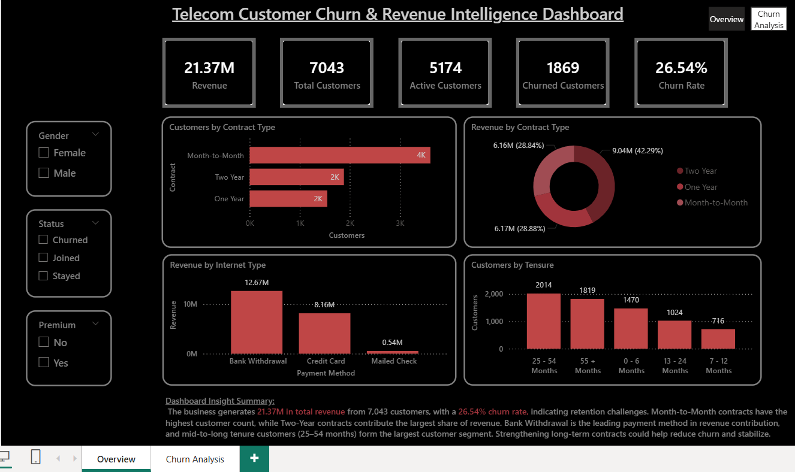
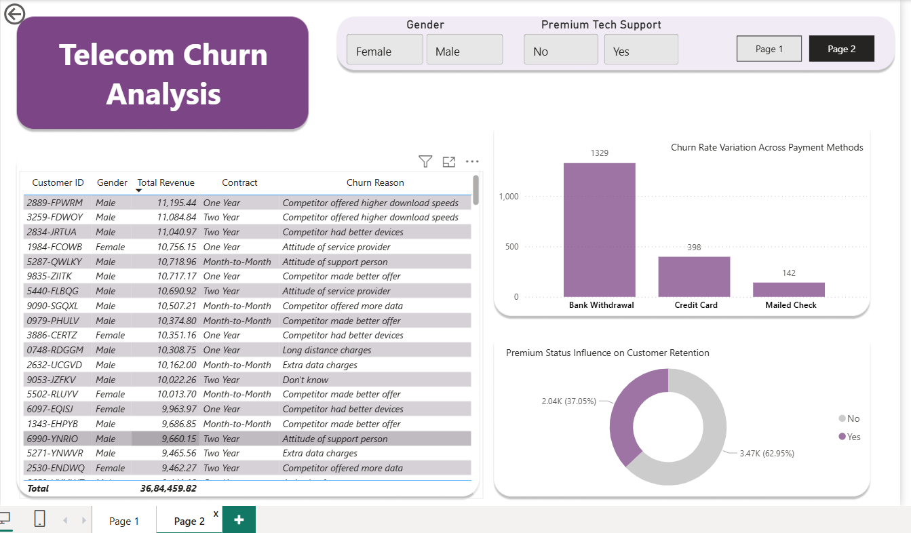

# 📡 Telecom Subscriber Intelligence: Revenue Recovery & Churn Diagnostic
> **An end-to-end data analytics case study identifying $3.6M in revenue leakage through Excel-based ETL and Power BI Interactive Dashboards.**

## 📋 Project Overview
This project addresses high attrition rates within a subscriber base of **7,043 records**. By conducting a rigorous **Data Quality Audit** and **Exploratory Data Analysis (EDA)**, I identified that **88.5% of churned revenue** is tied to Month-to-Month contracts. This repository documents the professional transition from raw Excel data to a strategic retention roadmap.

---

## 🛠️ Technical Methodology
* **Data Engineering:** Microsoft Excel (Power Query, Logic Layer, Data Imputation).
* **Business Intelligence:** Power BI (DAX Modeling, Relational Mapping, Visualization).
* **Analytical Framework:** Cohort Analysis, Anomaly Detection, and Root Cause Analysis (RCA).

---

## 🧹 Phase 1: Data Quality Audit (The Issue Log)
I utilized Excel to perform a systematic ETL (Extract, Transform, Load) process. This ensured that downstream KPIs were not skewed by raw data errors found in the source files.

| Dimension | Technical Issue | Analytical Resolution (Excel) |
| :--- | :--- | :--- |
| **Billing Accuracy** | 120 negative `Monthly Charge` values | Recalculated using `=Total_Charges / Tenure` to restore ARPU integrity. |
| **Service Logic** | 1,526 Nulls in Internet segments | Implemented "Not Applicable" logical flags to prevent statistical bias. |
| **Cost Logic** | 682 records missing Phone Charges | Imputed as '0' for non-phone users to maintain accurate Total Revenue sums. |

*Full documentation of these steps is located in the **Issue and Insight Telecom** folder.*

---

## 📈 Phase 2: Diagnostic Insights (The Insight Log)
Analysis of the processed data revealed specific "Red Zones" where the company is losing the most value:

* **Contractual Volatility:** **88.5%** of churn is concentrated in Month-to-Month contracts—the strongest predictor of attrition.
* **Competitor Aggression:** **45%** of exits are driven by competitor offers. Price sensitivity is highest in the 0–6 month window.
* **The "First-Year Burn":** Subscriber attrition peaks in the first **6 months** (700+ customers lost), indicating a friction-filled onboarding experience.
* **High-Yield Risk:** Customers aged **55+** represent **49%** of the churned population.

---
## 🎨 Phase 3: Interactive Intelligence Dashboard
The final report translates these findings into a visual story for executive stakeholders.

**Dashboard View: Executive Summary**

**Dashboard View: Customer Segmentation**

## 💡 Phase 3: Strategic Recommendations
I have synthesized the findings into a **4-Pillar Retention Roadmap**:
1. **Contractual Migration:** Transition Month-to-Month users to 6-month 'Bridge Plans' to reduce monthly volatility.
2. **90-Day Hyper-Care:** Implement a proactive onboarding sequence (welcome calls) to survive the high-risk first 6 months.
3. **Service Quality Reform:** Address 'Support Person Attitude' (a top-3 churn reason) through CSAT-linked performance training.
4. **Behavioral Offers:** Replace generic promotions with data-driven, personalized discounts to prevent competitor poaching.

---

## 📂 Repository Navigation
* [**📊 Power BI Dashboard**](./Telecom_churn_report.pbix) - Interactive report file.
* [**📁 Data Source (Excel)**](./Data_source.xlsx) - Cleaned dataset used for analysis.
* [**📝 Issue & Insight Log**](./issue_insight_telecom.xlsx) - Documentation of data cleaning and findings.

---
## 👤 Author & Contact
**Akshay R** 

